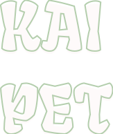

  

# Acerca del proyecto

🛍️ KAI PET es un comparador de productos para mascotas en las tiendas asociadas a la aplicación.

🏁 El proyecto terminó el 8/12/2023 pero se va seguir escalando en sus funcionalidades y su aspecto visual.

➕ *** Actualizacion 2.0 *** Se realizo una actualización el 21/11/2023, algunos de los cambios que se hicieron fueron: 
- Se ha ampliado en su totalidad el frontend con su camino de compra del usuario 
- Se establecio el backend Firebase para gestionar la base de datos e imagenes de la aplicación. A partir de ahora toda la información esta en la nube.
- Autenticacion mediante Firestore Authentication y el control de estados de los usuarios en la web.
- Se adiciono la posibilidad de compra en diferentes paises
- Gestión de usuario y visualizacion de su particiapación en la aplicación.
- Se agregó la posibilidad de que el usuario escoja productos favoritos.
- Desarrollo basado en la persistencia de todos los datos del usuario.
- Mejora en el control de stock de los productos.
- Se modificaron aspectos visuales de todo el sitio y se adapto el diseño responsive corrigiendo errores.
- Se realizaron test unitarios con Jest y react-testing-library. Tambien se hicieron testeos globales con Cypress. 
- Agregado y modificación de librerias varias como por ejemplo (react-hot-toast, spinners-react , react-copy-to-clipboard , headlessui y otros más)

## Herramientas utilizadas
Para crear el sitio y su diseño fueron utilizadas las siguientes herrammientas. 

👩🏻‍🎨 FIGMA : Diseño mediante wireframes en media y alta definición. Ademas se realizó el prototipado del sitio web. 

❤️ REACT JS : React es una biblioteca Javascript de código abierto diseñada para crear interfaces de usuario con el objetivo de facilitar el desarrollo de aplicaciones en una sola página.

✨ UI TAILWIND + FLOWBITE + HEADLESSUI : Componentes, íconos, estilos y cuadrículas de diseño de Tailwind (https://tailwindcss.com/) y Flowbite (https://flowbite-react.com/) una dependencia asociada al diseño de Tailwind y en este caso para reactJS. Tambien se uso HeadlessUI como dependencia asociada a Tailwind para mejorar la experiencia en el responsive con los componentes Dropdowns (https://headlessui.com/).

⚡️ Otras dependencias utilizadas: 

📱 CSS: En combinacion con tailwind y CSS se maquetó un sitio 100% responsive.  

🔙 BACKEND : Firebase Database.

👤 AUTH : Autenticacion con firebase Authentication

🖌️ Las imágenes y vectores fueron trabajados con illustrator y photoshop.

💎 Icons: heroicons , react-icons y vectores SVG.

✅ Tests: Test unitarios con Jest y react-testing-library. Testeo global con Cypress.

### Para utilizar la aplicación: 

1 En el escritorio crear una carpeta para uso con un nombre que pueda recordar  
2 buscar en el repositorio de la nube  el que vas a clonar  
3 En dar click en el botón verde llamado código y copiar la ruta que este trae  
4 Descargar NJS según la necesidad del proyecto y las especificaciones del equipo con el que contamos  
5 abrir la carpeta creada con anterioridad darle click derecho y seleccionar más opciones  dar click en Git Bash Here  
6 Al abrir la consola escribir el comando git clone y se pega el link copiado en el paso 3 y enter  
7 Una vez aparezca la ruta de la carpeta en la consola con la palabra main al final se debe escribir cd desktop y enter  
8 Siguiente git add npm install   
10 Abrir la carpeta del frontend  : cd frontend enter  
11 npm run dev (dev es uno de los scripts de la carpeta package njs aparece después de abrirla con el visual studio code)  
12 Aqui aparece el localhost del proyecto 
  ➜  Local:   http://localhost:5173/  
13 Para actualizar cambio git pull origin development  
14 Para correr lo cambios npm run dev   

#### Equipo de trabajo

Alejandra Ortiz - Tester QA  
Alejandra Vedoya - Backend  
Leandro Vizgarra - Backend  
Micaela Echegaray - UX/UI  
Alexis Rodriguez - Frontend  
Sebastián Barcia - Frontend  

##### NO COUNTRY
De parte de todo el equipo de KAI PET agradecemos a la plataforma NO COUNTRY por dejarnos desarrollarnos en esta linda experiencia!. 

